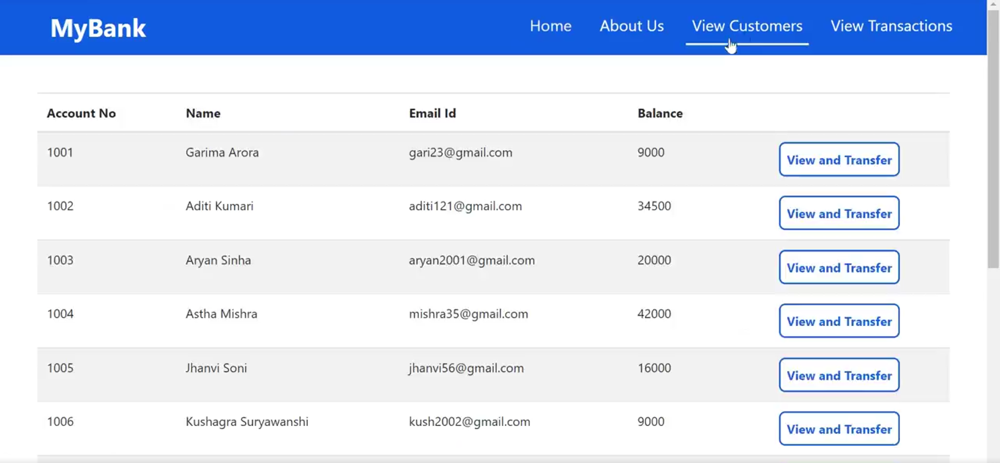

  <h2 align="center">Banking Application</h2>

<!-- ABOUT THE PROJECT -->
## About The Project
* This Node.js application utilizes the Express framework and EJS templating engine to build a banking system. 
* It includes routes for managing customers and transactions with a MySQL database. 
* The application handles tasks such as displaying customer lists, adding new users, transferring money between accounts, and viewing transaction histories. 
* EJS templates are used to render dynamic content, including forms for user input and tables for displaying data. 
* The frontend features a user-friendly interface with buttons and links to navigate between different functionalities, enhancing user interaction and experience.

### Tech Stack

* HTML
* CSS
* Node.js
* MySQL

### Screenshots

